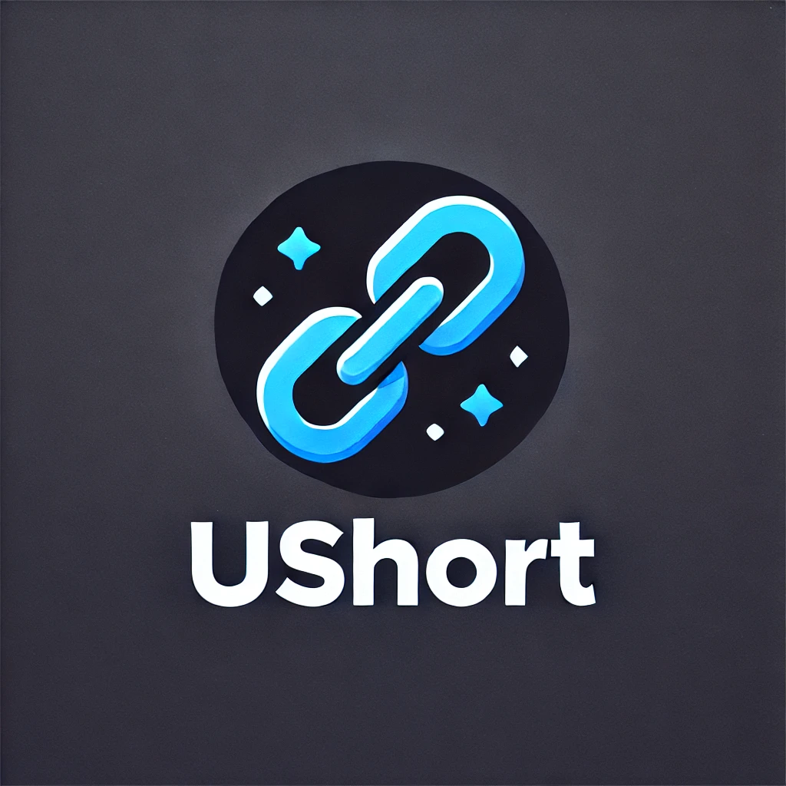

# Ushort

Ushort is a URL shortening service written in Go. It uses Mongodb to store the short URL and original URL.

## Getting Started

These instructions will get you a copy of the project up and running on your local machine for development and testing purposes.

### Prerequisites

- Go
- Mongodb

### Installing

1. Clone the repository

```bash
git clone https://github.com/Dubjay18/Ushort.git
```

2. Navigate to the project directory

```bash
cd Ushort
```

3. Install the dependencies

```bash
go mod download
```

4. Start the application

```bash
go run main.go
```

## Running the tests

To run the tests, use the following command:

```bash
go test ./...
```

## Built With

- [Go](https://golang.org/) - The programming language used
- [Redis](https://redis.io/) - In-memory data structure store, used as a database and cache
- [Gin](https://github.com/gin-gonic/gin) - HTTP web framework written in Go

## Authors

- **Dubjay18** - _Initial work_ - [Dubjay18](https://github.com/Dubjay18)
